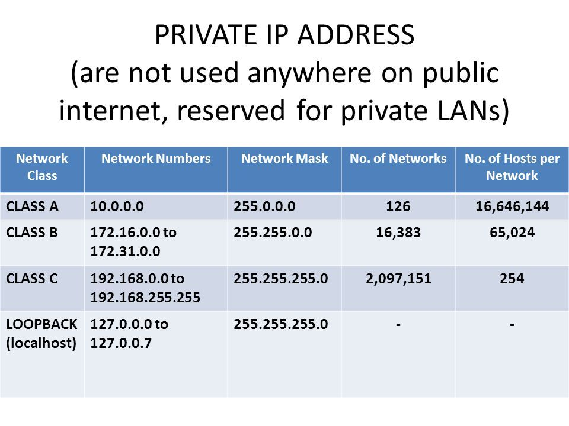

# Networking Refresher

## IP Addressing
`ifconfig` command shows IPv4 and IPv6 addresses
* IPv4 
  * Enables communication over "layer 3", which is routing
  * "Layers" refer to the OSI model
  * 32 bit (4 byte) number -> 4.2 billion possible IP addresses
  * All addresses in the address space are taken
* IPv6
  * Adds 2 bits, which gives a much larger address space
  * Not really used
* NAT (network address translation) enables us to keep using IPv4 even though the address space is fully used
  * Assigns IPs in a private address space
  * Pretty much all IP addresses other than the ones in the ranges shown in the image below are owned, but can be bought/rented from ISPs 

## MAC Addresses
* Media Access Control - physical address
* Anything that uses the internet has a MAC address
* MAC addresses enable communication over "layer 2" which is related to switching
* Found in the "ether" section of the `ifconfig` output
* First 3 sections of a MAC address are identifiers, e.g. VMWare or Texas Instruments

## TCP, UDP, and the Three-Way Handshake
* Related to "layer 4" is the transport layer
* TCP (transport control protocol)
  * Connection oriented
  * Suited for high reliability
  * Works on a "three-way handshake"
* UDP (user datagram protocol)
  * Connection-less
* Three Way Handshake
  * SYN -> SYN ACK -> ACK
  * Example: Connecting to a website on port 443 (HTTPS)
    1. Send SYN packet saying "I want to connect on 443"
    2. Site sends SYN ACK packet back if 443 is open for connection
    3. Send ACK packet back to connect
* Wireshark is a tool used to track packets

## Common Ports and Protocols
* TCP
  * FTP (21) - File Transfer Protocol
  * SSH (22) - Same as telnet, but encrypted
  * Telnet (23) - Ability to log into a machine remotely
  * SMTP (25) - mail
  * DNS (53) - resolves IP addresses to names, e.g. Google -> IP address
  * HTTP (80) - website, unencrypted, unsecure
  * HTTPS (443) - website, encrypted, secure
  * POP3 (110) - mail
  * SMB (139 + 445) - fileshares. Used for wannacry virus, very often exploited
  * IMAP (143) - mail
* UDP
  * DNS (53)
  * DHCP (67, 68)
  * TFTP (69) - trivial FTP
  * SNMP (161) - Simple network management protocol

## The OSI Model
* Mnemonic: PDNTSPA - "Please do not throw sausage pizza away"
* Layers:
  1. Physical - data cables, cat6
  2. Data - Switching, MAC addresses
  3. Network - IP addresses, routing
  4. Transport - TCP, UDP
  5. Session - session management
  6. Presentation - SMV, JPEG, MOV
  7. Application - HTTP, SMTP
* Data transfer (in and out) always involves every layer

## Subnetting
* Subnet is shown by the `netmask` attribute in `ifconfig` output
* Subnets are identified by a 32 bit number
  * Bits can only be turned on/off in order, i.e. 1010101... is not valid, 111000... is valid
* "/24 network" is a common subnet for households and small businesses
  * 255.255.255.0
  * "24" refers to the fact that the first 24 bits are turned on
  * Allows 256 hosts
* The larger the company, the more likely it is that they need more hosts, so they might want a "/16 network"
* Realistic example:
  * 10.1.0.0/16 network
  * Subnet mask: 255.255.0.0
  * 10.1.x.x is locked down: 10.1 is locked down, both x's can take on values from 1-254
* First and last addresses in a subnet are (usually) reserved for the network and broadcast addresses, respectively
  * E.g. x.x.x.0 is the network address in a x.x.x.0/24 network
  * E.g. x.x.x.255 is the broadcast address in a x.x.x.0/24 network
* ipaddressguide.com/cidr is an online CIDR to IPv4 conversion tool