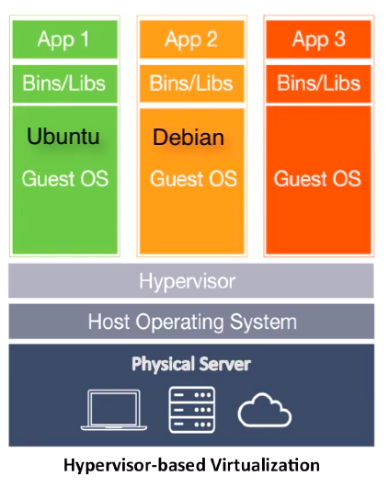
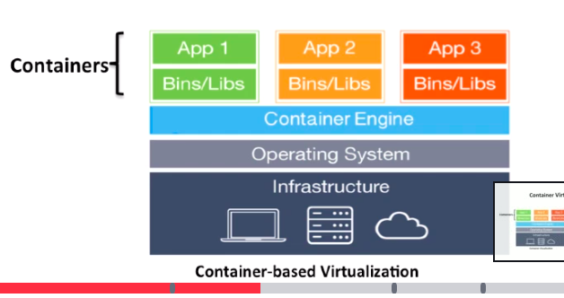
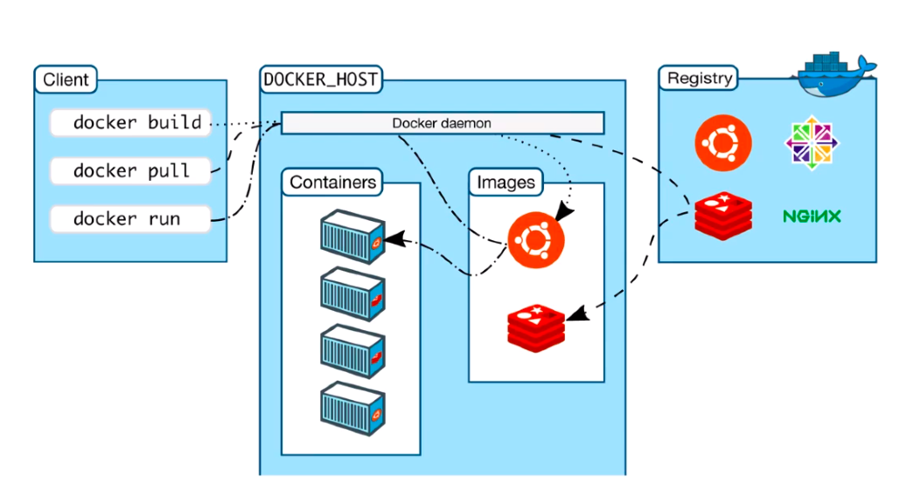

# Section 2: Docker Crash Course

## Introduction to Docker Crash Course

Why virtualization? Because using physical servers was:
- costly
- slow deployment
- hard to migrate

As a result, we came up with hypervisor based virtualization:



Some popular hypervisor virtualization providers are VMWare and VirtualBox, but now we're used to deploying our own VMs on cloud based solutions.

Hypervisor virtualization is more cost efficient and easier to scale than using physical servers, but it's also resource intensive,
because it requires us to duplicate kernel functionality. It's also difficult to ensure application portability.

In response, we came up with container based virtualization, which shares the host OS to reduce resource duplication.



In container virtualization, we install all required code in the container, including dependencies.

Benefits of container virtualization:
- Cost and resource efficient - containers do not create an entire virtual operating system
- Fast deployment - containers house the minimal requirements for running the application
- Guaranteed portability - containers are essentially independent applications

## Docker Software's Client-Server Architecture

Docker uses a client-server architecture with a daemon as the server, as seen below.
The daemon is often is a persistent process often referred to as Docker engine or docker server, and does the heavy lifting of running and distributing your containers.


## Important Concepts of Docker

Images
- Images are read only templates used to create containers
- Images are created with the docker build command
- Images are composed of layers of other images
- Images are stored in a Docker registry

Containers
- Instance of an image
- Lightweight and portable encapsulations of an environment in which to run applicaitons
- Contain all binaries and dependencies needed to run the application

Registries and Repositories
- Registries store images 
- Inside a registry, images are stored in repositories
- A repository is a collection of images with the same name with different tags, where each tag usually represents a different version of the image

Docker Official Images
- Reviewed by a dedicated team at docker
- Clear documentation
- Adhere to best practices
- Security updates in a timely manner
- Don't have a namespace

## Deep Dive into Docker Containers
To run containers in interactive mode, use the `-it` options.

However, most containers run in "detached" mode using the `-d` option. This means that they are run in the background.

To list containers, use `docker ps`. To include all containers, including stopped ones, use the `-a` option.

To run a container and then remove it from the container list when it finishes, use the `--rm` option.

To show low level details about a container, use `docker inspect <container ID>`.

## Docker Port Mappings and Docker Logs
Use the `-p` option to expose a port for a container. For example, the tomcat server runs on port 8080 by default.
To map the 8080 port in the tomcat container to your local host port 8888, use the following command:

```docker run -it --rm -p 8888:8080 tomcat:8.0```

To print out container logs, use the `docker logs <container ID>` command.

## Docker Image Layers
Each image consists of multiple layers, which are really images themselves and represent file system differences. 
To show the layers in an image, you can use the `docker history <image>` command.

When you start a container, a thin writable layer is added. That's where all data writes happen. This allows multiple containers to share a base image.